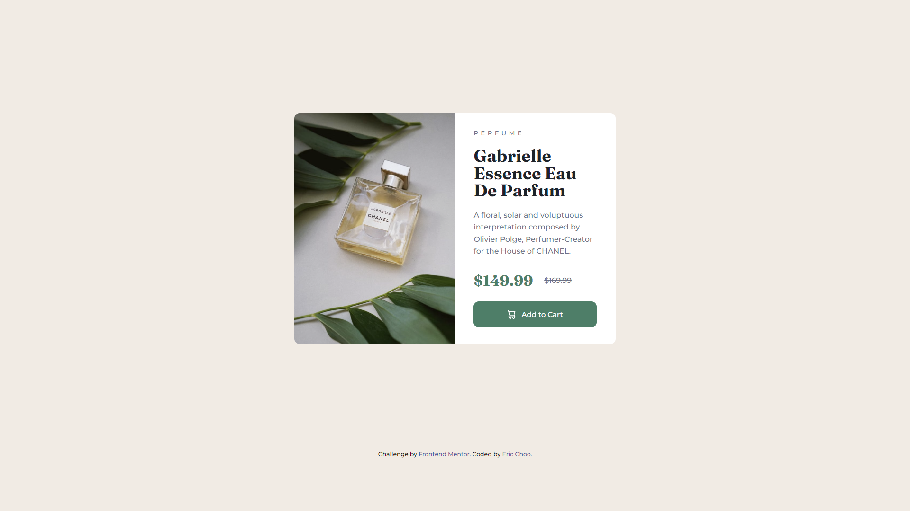

# Frontend Mentor - Product preview card component solution

This is a solution to the [Product preview card component challenge on Frontend Mentor](https://www.frontendmentor.io/challenges/product-preview-card-component-GO7UmttRfa). Frontend Mentor challenges help you improve your coding skills by building realistic projects. 

## Table of contents

- [Overview](#overview)
  - [The challenge](#the-challenge)
  - [Screenshot](#screenshot)
  - [Links](#links)
- [My process](#my-process)
  - [Built with](#built-with)
- [Author](#author)

## Overview

### The challenge

Users should be able to:

- View the optimal layout depending on their device's screen size
- See hover and focus states for interactive elements

### Screenshot

&nbsp; &nbsp;&nbsp;
 

### Links

- Solution URL: [Add solution URL here](https://your-solution-url.com)
- Live Site URL: [Add live site URL here](https://your-live-site-url.com)

## My process

Complete duration: 3 days (9 Sep 2022 - 11 Sep 2022).

### Built with

- SASS (SCSS)
- Flexbox
- CSS - BEM methodology
- Mobile-first workflow

## Author

- GitHub - [Eric Choo](https://github.com/ericcst197)
- Frontend Mentor - [@ericcst197](https://www.frontendmentor.io/profile/ericcst197)

